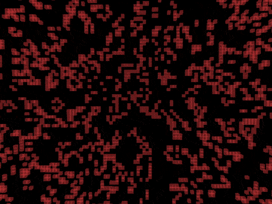

# Futz

>Verb. futz (around) with, to handle or deal with, especially idly, reluctantly, or as a time-consuming task

Oh my. You've found Futz. This is a super casual, hobby project. I am making a cross-platform, 3D engine in my spare time. As one does.
Also, its main target is the Dreamcast. 

 


## How's it going?

Not bad, thanks for asking. It's been a fun exercise so far.

Futz has platform (input and rendering) abstraction layers which allow it to run on:
* Dreamcast
* SDL1 (Windows, Mac, Linux)
* SDL2 (Windows, Mac, Linux)
* GLUT (Windows, Mac, Linux)
* Android
* iOS

However, only SDL2 and Dreamcast are regularly tested.


## What can it do?

Futz is C++ that compiles into a library for other C++ programs to use. It provides game engine features like:
* Vector, Matrix and Quaternion classes and operations
* 3D model, vertex color and texture loading and rendering (Waveform OBJ format)
* Input abstraction
* A component/entity system for creating game entities and attaching properties and logic
* A scenegraph for storing and manipulating references to entities
* Transparent and opaque render queues
* Depth sorting of transparent entities
* Build-in component types:
  * Axis Aligned Bounding Box
  * Bounding Box
  * Bounding Sphere
  * Box Collider
  * Draw Axis
  * Draw Model
 * A camera class
 
 ## Example Code
 Here's a snippit of what it looks like to load and place a model.

 
 ```c++
 void Demo::MyStartFunction(){
  // Get a reference to the futz singleton
  Futz* futz = Futz::Instance(); 

  // Create a blank node to hold our spaceship
  Node* spaceship = new Node();

  // Load a 3d model
  char* file = (char*)"assets/taxi_model.obj";
  spaceship = futz->LoadModel(file);
  spaceship->Load();

  // Position, rotate and scale the ship
  spaceship->transform.SetPosition(0, 10, 0);
  spaceship->transform.SetRotation(90, 0, 0);
  spaceship->transform.scale = 1;

  // Add it to the scene
  futz->scene.AddNode(spaceship);
}

 ```
 ## Compiling tips
 Warning! Several of the demos are out of date. Only expect src/demo to compile currently!
 
 ### Windows
 Should build with Visual Studio 2017.
 Compiled demo and life binaries need to execute in a path along with a 32bit SDL2.dll and their assets folder.
 
 ### Unix
 You'll need some dev libraries like SDL2 installed on your system. Make sure src/futz/bin exists.

 ```bash
 #compile futz. SDL2 is the most recently tested
 ~/Documents/git/futz/src/futz$ make sdl2
 ```

 src/demo works with SDL2. At least on linux and dreamcast right now.
 ```bash
~/Documents/git/futz/src/demo$ make LAYER=SDL2
```
 
 

